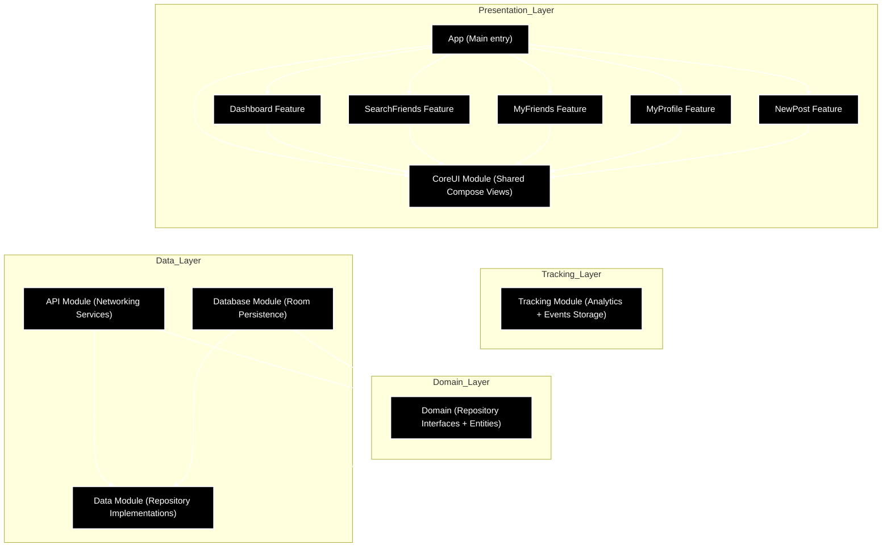
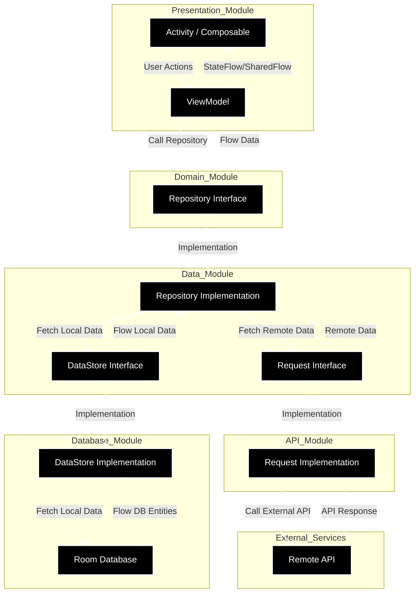

# Pokemaniac – Proof of Concept (POC)

Welcome to the Pokemaniac POC!
This document provides a complete overview of the app’s current state, including technical implementation, business logic, and what’s coming next.

The whole documentation is available in [the Github's Wiki](https://github.com/Fabryo/PokeManiac/wiki).

## How to Run the App

Instructions for installing and launching the app locally are available [here](https://github.com/Fabryo/PokeManiac/wiki/Setup).

## Architecture & Tech Stack

 * Modular architecture following Clean Architecture principles
 * Fully built with Jetpack Compose
 * Key patterns: MVVM, StateFlow, DI with Koin, etc.
 * Libraries: Retrofit, Room, Coil, Coroutines, Flow, Koin, etc.

#### Module Dependency Diagram
   

#### Architecture Data Flow

The Architecture in detail is available [here](https://github.com/Fabryo/PokeManiac/wiki/Architecture-&-Tech-choices#architecture).

More information about the Tech stack is available [here](https://github.com/Fabryo/PokeManiac/wiki/Architecture-&-Tech-choices#tech-choices).

## Concept & Business Plan
 * A social network dedicated to Pokémon card collectors
 * Key features: card library, friend interactions, transaction sharing, and a future marketplace
 * Monetization options: subscriptions, ads, transaction fees

The whole Concept & Business Plan are available [here](https://github.com/Fabryo/PokeManiac/wiki/Concept-and-Business-Plan).

## Business Features Implemented
 * NewsFeed with friend transactions
 * Friend search and subscriptions
 * Profile screen with personal transaction history
 * Transaction posting flow (photo, Pokémon name, price)
 * Local data persistence

More information, screens and videos about the implemented Business Features are available [here](https://github.com/Fabryo/PokeManiac/wiki/Implemented-Business-Features).

## Technical Features Implemented
 * i18n: French 🇫🇷 and English 🇬🇧 supported
 * Dark Mode support
 * Tracking module (mocked, ready to connect to Firebase, Segment…)
 * Unit testing examples across all layers (Request, Repository, UseCase, ViewModel)
 * Jetpack Compose Previews for UI testing

More information about the implemented Tech Features are available [here](https://github.com/Fabryo/PokeManiac/wiki/Tech-Features#implemented-tech-features-).

## Technical Features To Be Added
 * Crash reporting & code quality tools: Crashlytics, Sonar, Lint…
 * Accessibility support
 * Proguard / R8 obfuscation for code security
More information about the backlogged Tech Features are available [here](https://github.com/Fabryo/PokeManiac/wiki/Tech-Features#technical-features-to-add).

## Key Business Features To Be Implemented
 * Full Sign In / Sign Up flow
 * Onboarding journey & subscription paywall
 * Bottom navigation with tabs (Home, Pokédex, Card Search, Marketplace)
 * Marketplace with secure transactions
 * Tablet layout & responsive design
 * AI card recognition and valuation
More information about the backlogged Business Features are available [here](https://github.com/Fabryo/PokeManiac/wiki/Remaining-Features-to-implement)
  
